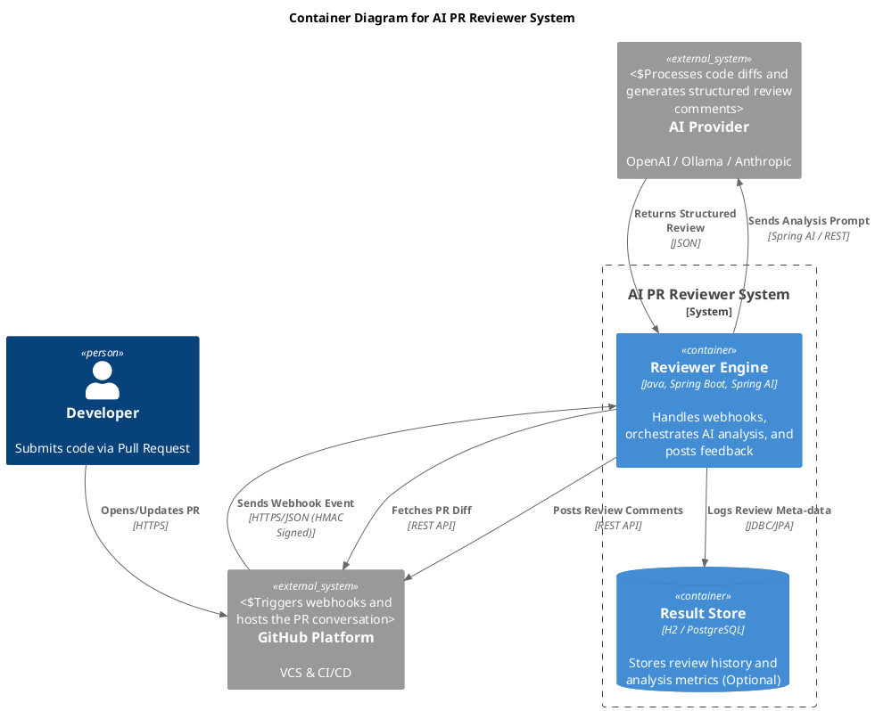
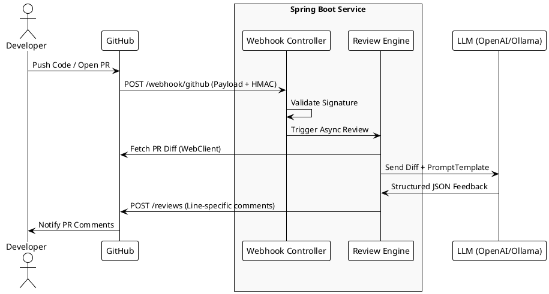
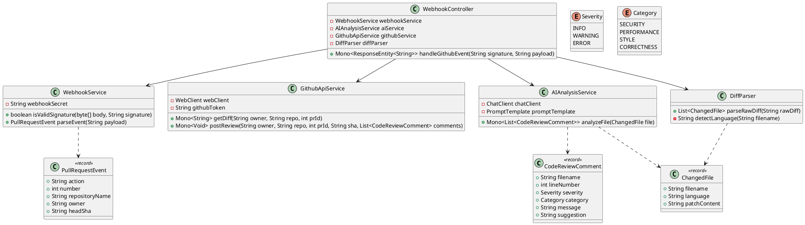

# Design Document: AI-Powered Automated PR Reviewer

### 1.1 Purpose

To automate the initial "sanity check" of code changes in a GitHub repository. This tool acts as a first-line reviewer that identifies security vulnerabilities, performance bottlenecks, and style inconsistencies using Generative AI, allowing human reviewers to focus on high-level architecture.

---

## 2. Technical Stack & Dependencies

### 2.1 Core Stack

* **Language:** Java 21 (utilizing Virtual Threads and modern syntax)
* **Framework:** Spring Boot 3.5
* **AI Orchestration:** Spring AI (supporting OpenAI/Ollama/Anthropic)
* **Reactive Stack:** Project Reactor (WebFlux)
* **API Integration:** GitHub REST API via Spring `WebClient`
* **Build Tool:** Maven

### 2.2 Key Dependencies

```xml
<dependencies>
    <dependency>
        <groupId>org.springframework.ai</groupId>
        <artifactId>spring-ai-starter-model-openai</artifactId>
    </dependency>
    <dependency>
        <groupId>org.springframework.boot</groupId>
        <artifactId>spring-boot-starter-webflux</artifactId>
    </dependency>
    <dependency>
        <groupId>org.springframework.boot</groupId>
        <artifactId>spring-boot-starter-security</artifactId>
    </dependency>
</dependencies>
```

---

## 3. System Architecture

### 3.1 High-Level Diagram (Container Diagram)

This diagram shows how the major blocks of the system interacts together. Each container represent a separately deployable unit (GitHub and the AI Provider).



### 3.2 High-Level Diagram (System Context)

This diagram shows how the system interacts with external entities (GitHub and the AI Provider).



### 3.2 Low-Level Class Diagram

This defines the internal structure, fields, and methods of your Spring Boot application.



---

## 4. Core Logic Flow

1. **Ingestion:** The `WebhookController` receives a JSON payload. It uses `WebhookService` to verify the `X-Hub-Signature-256` using an HMAC-SHA256 hash of the payload and a stored secret.
2. **Diff Extraction:** If the event is `pull_request.opened`, the `GithubApiService` fetches the raw diff text.
3. **Reactive Processing:** * The diff is split into file-based chunks.
   * `Flux.fromIterable(files).flatMap(file -> aiService.analyze(file))` processes files concurrently.
4. **AI Analysis:** The `ChatClient` uses a `PromptTemplate` to force the LLM to return a JSON array that matches the `CodeReviewComment` schema.
5. **Feedback Loop:** Once all `Mono` objects complete, the collected list of comments is sent back to GitHub in a single API call to create the PR review.

---

## 5. Security Considerations

* **Payload Validation:** Requests without a valid HMAC signature are rejected with a `401 Unauthorized` to prevent DOS attacks.
* **Secret Management:** GitHub tokens and Webhook secrets are stored in environment variables or a secure Vault, never hardcoded in `application.properties`.
* **Rate Limiting:** Reactive backpressure is handled by `WebFlux` to ensure we don't overwhelm the LLM API or GitHub's rate limits.

---

**Next Step:** Since you are a Maven user, would you like me to generate the complete `pom.xml` file with these specific dependencies so you can initialize the project?
